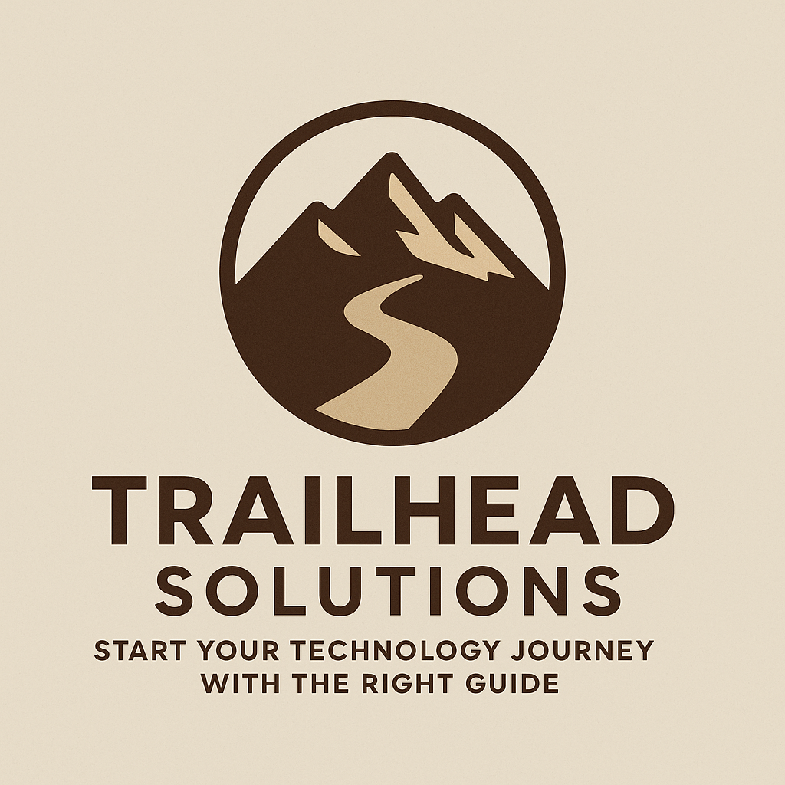

  

---

### About

**Trailhead Solutions** is a boutique IT consultancy dedicated to helping organizations embark on—and navigate—their technology journey. Like an experienced guide at the trailhead, we offer the expertise, insight, and reliable support needed to set out with confidence, whether you’re charting your foundational path or forging ahead to new heights.

---

### Our Expertise

From strategy through implementation, our focus areas include:

- **Device Management & Deployment**  
  Streamlining secure endpoint onboarding, provisioning, and lifecycle management.
- **Infrastructure & Network Planning**  
  Designing secure, resilient, and scalable systems for modern business.
- **Cloud & Collaboration Solutions**  
  Enabling protected teamwork and business continuity with industry-leading platforms.
- **Process & Operational Improvement**  
  Optimizing workflows and enabling growth through automation and best practices.
- **Security & Risk Management**  
  Assessing threats, strengthening cyber defenses, and ensuring compliance to protect your organization’s data, devices, and users.

---

### How We Work

We begin with attentive listening. By understanding your unique goals and challenges, we chart a practical route forward—offering reliable guidance and support at every step.

---

### Mission

Our mission is to provide trusted technology leadership that helps organizations start strong, stay aligned, and achieve their ambitions.

---

### Invitation Only

- Trailhead Solutions partners with a limited number of organizations each year to provide focused, high-impact consulting.  
- Currently, we welcome new client relationships exclusively through professional introductions or referrals.  
- We appreciate your interest in our practice.

---

<footer style="text-align:center; color:#555; margin-top:3em; padding:1em 0;">
  © 2025 Trailhead Solutions LLC. All rights reserved.
</footer>
